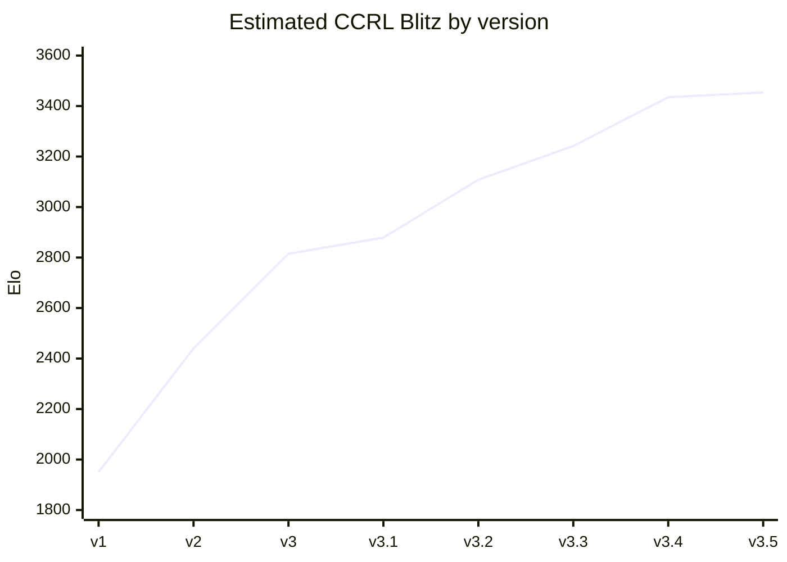
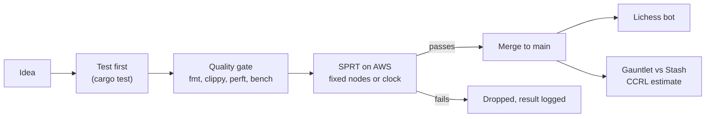

# Caipora

**An original UCI chess engine from Brazil, written from scratch in Rust, with its own NNUE.**

[](https://github.com/ComputecOrg/caipora/actions/workflows/ci.yml)
[](https://lichess.org/@/caiporaBot)
[](LICENSE)
[](AI_USAGE.md)

Caipora is named after a forest guardian of Brazilian folklore. It started on 26 September 2026
with an empty repository and went from ~1950 to ~3450 CCRL Blitz (estimated) in five days. The
code is written by [Claude Code](https://claude.com/claude-code) under the direction, review and
testing of its author, and that is declared everywhere: see [AI_USAGE.md](AI_USAGE.md).

**Play it:** [caiporaBot on Lichess](https://lichess.org/@/caiporaBot), online around the clock.

---

## At a glance

| | |
|---|---|
| **Version** | 3.6 (30 September 2026) |
| **Strength** | ~3454 CCRL Blitz estimated for v3.5 (gauntlet vs Stash, 1 thread); v3.6 measured above it, gauntlet pending |
| **Lichess** | caiporaBot, blitz 2854 after 361 games (1 October 2026) |
| **Evaluation** | NNUE (768×8 king buckets → 1024)×2 → 8 output buckets, SCReLU, trained in-house with [bullet](https://github.com/jw1912/bullet) on Leela Chess Zero data (ODbL) |
| **Search** | alpha-beta with PVS and singular extensions, Lazy SMP, pondering |
| **Variants** | standard chess and Chess960 / DFRC |
| **License** | GPL-3.0-or-later |

## Where it is going

| Goal | Status |
|---|---|
| Pass **Tucano** (3491), the strongest Brazilian engine | about 35 points away (v3.5); v3.6 should be close |
| **3000 blitz** on Lichess | 2854 and climbing |
| Official **CCRL** listing | repository public since 1 October 2026; first release next |
| **TCEC** | after CCRL |

## Strength so far

Each point is a gauntlet against [Stash](https://gitlab.com/mhouppin/stash-bot) versions with
known CCRL Blitz ratings, at 8+0.08 with 1 thread (80 to 300 games per opponent).



| Version | Date | Estimate | What made the difference |
|---|---|---|---|
| v1 | 26 Sep | ~1950 | move generation, alpha-beta, hand-written evaluation |
| v2 | 27 Sep | ~2440 | null move, LMR, futility, SEE, killers, history |
| v3 | 27 Sep | ~2815 | first NNUE (g1), trained on Caipora's own games |
| v3.1 | 27 Sep | ~2879 | continuation history, TT in buckets, TT in quiescence |
| v3.2 | 27 Sep | ~3108 | Lazy SMP and network g2 |
| v3.3 | 28 Sep | ~3242 | pondering and network g3 (512 hidden) |
| v3.4 | 28 Sep | ~3435 | network g4, first one trained on Leela Chess Zero data |
| v3.5 | 30 Sep | ~3454 | network g5 (1024 hidden) |
| v3.6 | 30 Sep | pending | network g6 with king buckets (+23), singular extensions (+28), time by best-move stability (+16) |

The full log, with every SPRT and gauntlet, is in [docs/estado.md](docs/estado.md) (Portuguese).

## Milestones

| Date | Milestone |
|---|---|
| 26 Sep 2026 | Repository created; legal move generation passes the full perft suites, standard and Chess960 |
| 26 Sep 2026 | First game on Lichess |
| 27 Sep 2026 | First neural network inside the binary; bot moves to a server and starts playing rated |
| 28 Sep 2026 | First network trained on Leela Chess Zero data: +237 Elo in one step |
| 28 Sep 2026 | 200-game match against Stockfish 19 (1 thread each): 7.5% of the points |
| 30 Sep 2026 | Lichess blitz 2823; king-bucket network g6 and singular extensions |
| 1 Oct 2026 | Lichess blitz 2854; repository made public; bot joins the Lichess bot tournament circuit |

## How it is built



- **Every strength change is measured.** Search changes need an SPRT at fixed nodes, time changes
  an SPRT on the clock, with [fastchess](https://github.com/Disservin/fastchess) on rented AWS
  machines. Ideas that do not pass are dropped and logged (history-based LMR, TT-refined pruning
  eval and capture history are examples).
- **Every decision is written down** with the reason and the cost of being wrong, in
  [docs/decisoes.md](docs/decisoes.md) (Portuguese).
- **Every commit carries a bench signature** (`Bench: <nodes>`) that CI checks, so a change in
  search behaviour is never accidental.

### Engine

- **Board:** bitboards plus mailbox, magic bitboards (no PEXT, for Zen 2), copy-make, 16-bit
  moves, full Chess960 castling.
- **Search:** iterative deepening, aspiration windows, PVS, check and singular extensions
  (with multi-cut), internal iterative reduction, reverse futility, null move, late move
  reductions and pruning, futility, SEE pruning, quiescence with TT, killers, butterfly,
  continuation and correction histories, lock-free shared TT in buckets, Lazy SMP.
- **Time:** soft and hard limits, the soft one scaled by best-move stability and score drops;
  pondering.
- **Evaluation:** NNUE with 8 mirrored king buckets (own layout) and 8 material output buckets,
  int16 inference vectorised by the compiler (AVX2 build). The network is embedded in the binary.

### Networks

| Network | Data | Hidden | Notes |
|---|---|---|---|
| g1–g3 | Caipora self-play only | 256–512 | trained on a GTX 1660 at home |
| g4 | Leela Chess Zero (ODbL) | 512 | +237 Elo over g3 |
| g5 | Lc0, three months of 2023 | 1024 | +41 over g4 |
| g6 | same, interleaved | 1024, king and output buckets | +23 over g5, current |

No third-party network is ever used, not even as a starting point. Training pipeline:
[docs/nnue.md](docs/nnue.md) (Portuguese).

## Using it

Caipora speaks UCI and works in any chess GUI (Cute Chess, Arena, Banksia, En Croissant...).

```
cargo build --release
./target/release/caipora bench     # prints "Bench: <nodes> nodes <nps> nps"
```

The build targets x86-64-v3 (AVX2). For an older CPU:
`RUSTFLAGS="-C target-cpu=x86-64" cargo build --release`. The Rust toolchain is pinned in
`rust-toolchain.toml`.

| UCI option | Default | |
|---|---|---|
| `Hash` | 16 | MB |
| `Threads` | 1 | up to 256 |
| `Move Overhead` | 10 | ms |
| `Ponder` | false | |
| `UCI_Chess960` | false | |
| `EvalFile` | `<embedded>` | path to another network |
| `Clear Hash` | | button |

Extra commands: `bench [depth]`, `go perft N`, `d` (show the board), `eval`.

## Repository map

| Path | What is there |
|---|---|
| `src/` | the engine: board, move generation, search, NNUE, UCI |
| `trainer/` | network trainer, built on bullet |
| `net/` | the embedded network |
| `scripts/` | Lichess bot config, tournament sign-up, gauntlet, training helpers |
| `deploy/` | bot server setup and the AWS spot machines used for SPRTs |
| `docs/` | state and roadmap, decision log, NNUE and Lichess guides (Portuguese) |

## AI usage

Caipora is written by Claude Code (Anthropic). Its author directs the work, decides, reviews and
tests; every commit is co-authored by Claude. Ideas from other engines and papers are read to
understand them and then reimplemented; no code, constants or tables are copied. The full
policy, including training data, is in [AI_USAGE.md](AI_USAGE.md).

## License

GPL-3.0-or-later. See [LICENSE](LICENSE).
